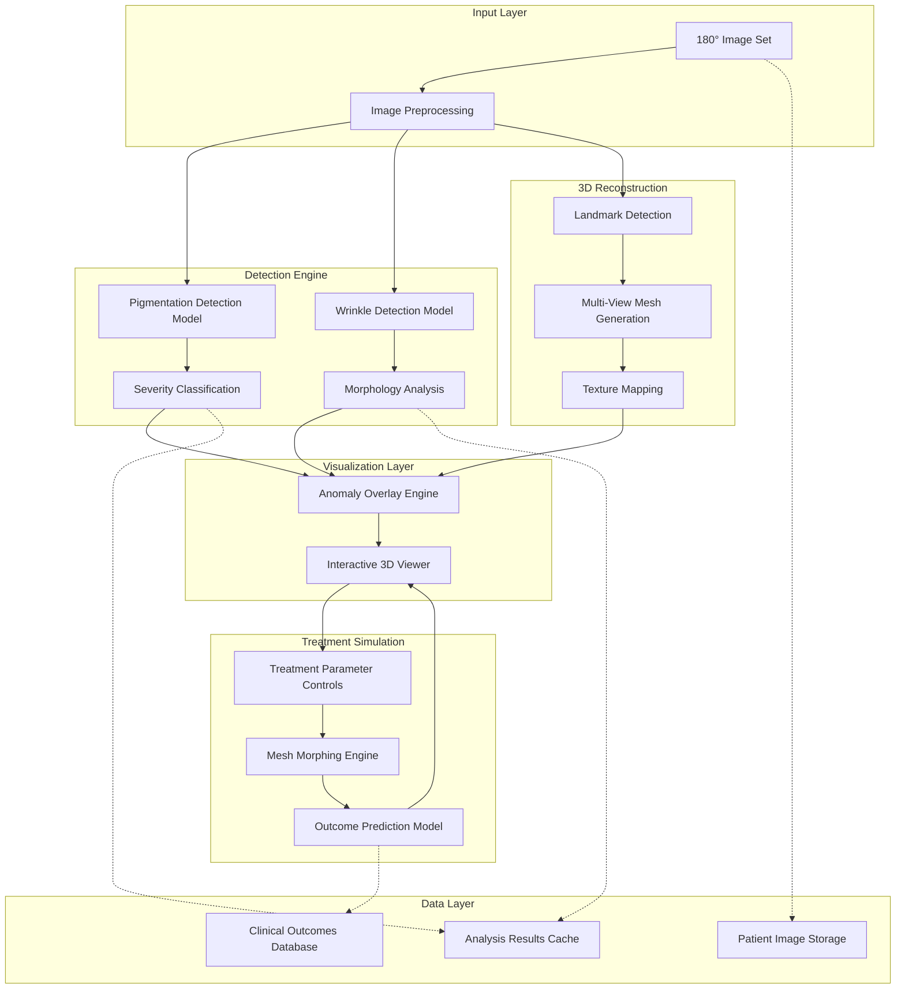

# Design Document: Dermatological Analysis PoC

## Overview

This design document outlines the architecture and implementation approach for a Proof of Concept (PoC) system that validates the technical feasibility of AI-driven dermatological analysis. The system combines computer vision, deep learning, and 3D facial reconstruction to detect skin conditions, visualize results on interactive 3D models, and predict treatment outcomes.

The system consists of four major components:
1. **AI Detection Engine**: Deep learning models for pigmentation and wrinkle detection
2. **3D Reconstruction Pipeline**: Multi-view facial reconstruction from 180-degree image sets
3. **Interactive 3D Viewer**: Real-time visualization with anomaly highlighting and filtering
4. **Treatment Simulation Engine**: Predictive modeling for aesthetic outcome visualization

The design emphasizes clinical accuracy, real-time performance, and user-friendly interaction while maintaining medical data security and privacy compliance.

## Architecture

### High-Level Architecture



### System Components

**Frontend Layer**:
- Web-based clinical dashboard (React/Vue.js)
- WebGL-based 3D viewer (Three.js)
- Real-time parameter controls and filtering UI

**Backend Services**:
- Image processing service (Python/FastAPI)
- AI inference service (PyTorch/TensorFlow)
- 3D reconstruction service (C++/Python)
- Treatment simulation service (Python)

**Data Storage**:
- Encrypted patient image storage (S3/Azure Blob)
- Analysis results database (PostgreSQL)
- Clinical outcomes database (PostgreSQL)
- Redis cache for real-time operations

**Infrastructure**:
- GPU-accelerated compute instances
- Load balancer for concurrent sessions
- API gateway for service orchestration
- Monitoring and logging (Prometheus/Grafana)

## Components and Interfaces

### 1. Image Preprocessing Module

**Purpose**: Validate, normalize, and prepare 180-degree image sets for analysis.

**Inputs**:
- Raw image set (JPEG/PNG, minimum 5 images covering 180° view)
- Image metadata (capture angle, resolution, lighting conditions)

**Outputs**:
- Normalized image tensors (standardized resolution, color space)
- Quality validation report
- Facial region masks

**Key Functions**:
```python
class ImagePreprocessor:
    def validate_image_set(images: List[Image]) -> ValidationResult
    def normalize_images(images: List[Image]) -> List[Tensor]
    def extract_facial_regions(images: List[Image]) -> List[Mask]
    def assess_image_quality(image: Image) -> QualityScore
```

**Processing Steps**:
1. Validate image count and angular coverage
2. Check resolution (minimum 1024x1024 pixels)
3. Assess lighting uniformity and focus quality
4. Normalize color space to sRGB
5. Resize to standard input dimensions (512x512 for detection models)
6. Apply face detection and cropping
7. Generate quality report with actionable feedback

### 2. Pigmentation Detection Model

**Architecture**: Modified U-Net with attention mechanisms for pixel-level segmentation.

**Model Design**:
- **Encoder**: ResNet-50 backbone pretrained on ImageNet
- **Decoder**: Upsampling layers with skip connections
- **Attention Module**: Channel and spatial attention for feature refinement
- **Output Head**: Multi-class segmentation (background, low, medium, high severity)

**Inputs**:
- Normalized facial image tensor (3 x 512 x 512)

**Outputs**:
- Segmentation mask (4 x 512 x 512) with class probabilities
- Pigmentation area coordinates and bounding boxes
- Per-area metrics: surface area, density, color deviation, melanin index

**Key Functions**:
```python
class PigmentationDetector:
    def detect_pigmentation(image: Tensor) -> SegmentationMask
    def classify_severity(mask: SegmentationMask) -> List[SeverityLabel]
    def calculate_metrics(mask: SegmentationMask, image: Tensor) -> PigmentationMetrics
    def estimate_melanin_index(region: Tensor) -> float
    def generate_heatmap(metrics: PigmentationMetrics) -> HeatMap
```

**Severity Classification Logic**:
- Extract RGB and LAB color values for each detected region
- Calculate chromatic intensity: `intensity = sqrt(a^2 + b^2)` in LAB space
- Calculate contrast ratio with surrounding skin
- Classify based on thresholds:
  - Low: intensity < 30, contrast < 1.5
  - Medium: 30 ≤ intensity < 60, 1.5 ≤ contrast < 2.5
  - High: intensity ≥ 60, contrast ≥ 2.5

**Melanin Index Estimation**:
- Based on spectral reflectance analysis (rephrased for compliance with licensing restrictions)
- Uses melanin absorption characteristics in visible spectrum
- Formula: `MI = 100 * log10(1 / R_650nm)` where R is reflectance at 650nm
- Approximated from RGB values using empirical mapping

### 3. Wrinkle Detection Model

**Architecture**: Edge-aware convolutional network with depth estimation.

**Model Design**:
- **Feature Extractor**: EfficientNet-B3 backbone
- **Edge Detection Branch**: Sobel-inspired learnable filters
- **Depth Estimation Branch**: Monocular depth prediction network
- **Fusion Module**: Combines edge and depth features
- **Output Head**: Wrinkle segmentation and attribute regression

**Inputs**:
- Normalized facial image tensor (3 x 512 x 512)

**Outputs**:
- Wrinkle segmentation mask (binary)
- Per-wrinkle attributes: length (mm), depth (mm), width (mm)
- Wrinkle classification: micro-wrinkle (<0.5mm depth) vs regular wrinkle
- Regional density scores for forehead, cheeks, peri-orbital areas
- Skin texture grading (smooth, moderate, coarse)

**Key Functions**:
```python
class WrinkleDetector:
    def detect_wrinkles(image: Tensor) -> WrinkleMask
    def measure_attributes(mask: WrinkleMask, depth_map: Tensor) -> List[WrinkleAttributes]
    def classify_wrinkles(attributes: List[WrinkleAttributes]) -> List[WrinkleType]
    def calculate_regional_density(mask: WrinkleMask, regions: List[Region]) -> Dict[str, float]
    def grade_skin_texture(image: Tensor, wrinkles: List[WrinkleAttributes]) -> TextureGrade
```

**Attribute Measurement**:
- **Length**: Skeletonize wrinkle mask, measure geodesic distance along centerline
- **Depth**: Sample depth map along wrinkle centerline, calculate mean depth relative to surrounding skin
- **Width**: Measure perpendicular distance across wrinkle at multiple points, take average
- **Pixel-to-mm conversion**: Use facial landmarks (e.g., interpupillary distance) as reference scale

**Depth Estimation**:
- Monocular depth prediction using MiDaS or similar architecture
- Relative depth values normalized to [0, 1] range
- Calibrated using known facial proportions
- Depth values converted to millimeters using landmark-based scaling

### 4. Facial Landmark Detection

**Architecture**: MediaPipe Face Mesh or Dlib 68-point landmark detector.

**Inputs**:
- Normalized facial image (512 x 512)

**Outputs**:
- 468 3D facial landmarks (MediaPipe) or 68 2D landmarks (Dlib)
- Landmark confidence scores
- Face bounding box and pose estimation

**Key Functions**:
```python
class LandmarkDetector:
    def detect_landmarks(image: Tensor) -> List[Landmark3D]
    def estimate_pose(landmarks: List[Landmark3D]) -> PoseMatrix
    def calculate_interpupillary_distance(landmarks: List[Landmark3D]) -> float
    def extract_facial_regions(landmarks: List[Landmark3D]) -> Dict[str, Region]
```

**Landmark Usage**:
- 3D mesh reconstruction anchor points
- Pixel-to-mm scaling reference
- Facial region segmentation (forehead, cheeks, etc.)
- Pose estimation for multi-view alignment

### 5. Multi-View 3D Reconstruction

**Architecture**: Structure-from-Motion (SfM) with morphable model fitting.

**Approach**:
1. **Feature Matching**: SIFT/ORB features across multiple views
2. **Camera Pose Estimation**: Bundle adjustment for camera parameters
3. **Dense Reconstruction**: Multi-view stereo (MVS) for dense point cloud
4. **Mesh Generation**: Poisson surface reconstruction
5. **Morphable Model Fitting**: Fit 3DMM (Basel Face Model or FLAME) to point cloud
6. **Texture Mapping**: Project images onto mesh using camera parameters

**Inputs**:
- Multiple facial images (5-10 images covering 180°)
- Detected landmarks for each view
- Camera intrinsic parameters (estimated or provided)

**Outputs**:
- 3D facial mesh (vertices, faces, normals)
- UV texture map
- Camera parameters for each view
- Mesh-to-image correspondence mapping

**Key Functions**:
```python
class FacialReconstructor:
    def match_features_across_views(images: List[Image]) -> FeatureMatches
    def estimate_camera_poses(matches: FeatureMatches) -> List[CameraParams]
    def generate_dense_pointcloud(images: List[Image], cameras: List[CameraParams]) -> PointCloud
    def reconstruct_mesh(pointcloud: PointCloud) -> Mesh
    def fit_morphable_model(mesh: Mesh, landmarks: List[Landmark3D]) -> MorphableModelParams
    def generate_texture_map(mesh: Mesh, images: List[Image], cameras: List[CameraParams]) -> TextureMap
```

**3D Morphable Model (3DMM)**:
- Uses parametric face model (e.g., Basel Face Model with ~200 shape parameters)
- Separates identity, expression, and texture components
- Enables realistic mesh deformation for treatment simulation
- Formula: `Face = Mean + Σ(α_i * Shape_i) + Σ(β_j * Expression_j)`

### 6. Anomaly Overlay Engine

**Purpose**: Map detected anomalies from 2D images onto 3D mesh surface.

**Inputs**:
- 3D facial mesh with UV coordinates
- Pigmentation segmentation masks (per view)
- Wrinkle segmentation masks (per view)
- Camera parameters for each view
- Mesh-to-image correspondence

**Outputs**:
- 3D mesh with anomaly vertex colors
- Per-vertex anomaly labels (type and severity)
- Layered texture maps (base skin, pigmentation overlay, wrinkle overlay)

**Key Functions**:
```python
class AnomalyOverlayEngine:
    def project_2d_to_3d(mask: SegmentationMask, mesh: Mesh, camera: CameraParams) -> VertexLabels
    def merge_multi_view_projections(projections: List[VertexLabels]) -> VertexLabels
    def generate_color_coded_overlay(labels: VertexLabels, color_map: ColorMap) -> VertexColors
    def create_layered_textures(mesh: Mesh, anomalies: VertexLabels) -> List[TextureMap]
```

**Projection Algorithm**:
1. For each pixel in segmentation mask:
   - Cast ray from camera through pixel
   - Find intersection with mesh surface
   - Assign anomaly label to intersected vertex
2. Aggregate labels from multiple views using voting
3. Smooth boundaries using bilateral filtering on mesh
4. Generate vertex colors based on anomaly type and severity

**Color Mapping**:
- Pigmentation Low: Light yellow (#FFE5B4)
- Pigmentation Medium: Orange (#FFA500)
- Pigmentation High: Dark red (#8B0000)
- Wrinkle Micro: Light blue (#ADD8E6)
- Wrinkle Regular: Dark blue (#00008B)
- Overlay transparency: 0.7 for blending with base texture

### 7. Interactive 3D Viewer

**Technology**: Three.js (WebGL) for browser-based rendering.

**Features**:
- Real-time mesh rendering (30+ FPS)
- Orbit controls (rotation, zoom, pan)
- Multiple shading modes (flat, smooth, wireframe)
- Layered texture rendering with transparency
- Region isolation and highlighting
- Measurement tools (distance, area)
- Snapshot export (PNG, JPEG)

**Inputs**:
- 3D mesh (vertices, faces, normals, UV coordinates)
- Texture maps (base, pigmentation overlay, wrinkle overlay)
- Vertex colors for anomaly highlighting
- Camera parameters for initial view

**Outputs**:
- Interactive 3D visualization
- User interaction events (click, hover, drag)
- Measurement results
- Exported snapshots

**Key Functions**:
```javascript
class Interactive3DViewer {
    loadMesh(mesh: Mesh, textures: TextureMap[]): void
    setColorMap(colorMap: ColorMap): void
    toggleAnomalyLayer(layerType: string, visible: boolean): void
    filterBySeverity(severityLevels: string[]): void
    isolateRegion(region: string): void
    measureDistance(point1: Vector3, point2: Vector3): float
    measureArea(vertices: Vector3[]): float
    exportSnapshot(format: string): Blob
}
```

**Filtering Logic**:
- Maintain separate vertex color buffers for each anomaly type and severity
- On filter change, recompute visible vertex colors by blending active layers
- Update shader uniforms to control layer visibility and transparency
- Render in single pass for performance

### 8. Treatment Simulation Engine

**Purpose**: Predict and visualize aesthetic outcomes of dermatological treatments.

**Supported Treatments**:
- **Wrinkle Reduction**: Botox, fillers, laser resurfacing
- **Pigmentation Correction**: Chemical peels, laser therapy, topical treatments
- **Acne Improvement**: Topical treatments, laser therapy
- **Redness Minimization**: IPL, laser therapy
- **Lip Augmentation**: Filler injection simulation
- **Facial Contouring**: Filler placement simulation
- **Eyelid/Cheek Lifting**: Surgical lifting simulation

**Inputs**:
- 3D facial mesh with anomaly labels
- Treatment type and parameters (intensity, target regions)
- Patient characteristics (age, skin type, condition severity)
- Historical treatment outcome data

**Outputs**:
- Modified 3D mesh (geometry and texture)
- Predicted outcome confidence score
- Multi-stage timeline (30/60/90 days)
- Treatment recommendations

**Key Functions**:
```python
class TreatmentSimulator:
    def simulate_wrinkle_reduction(mesh: Mesh, wrinkles: List[Wrinkle], intensity: float) -> Mesh
    def simulate_pigmentation_correction(mesh: Mesh, pigmentation: List[PigmentArea], intensity: float) -> Mesh
    def simulate_structural_enhancement(mesh: Mesh, enhancement_type: str, params: Dict) -> Mesh
    def predict_outcome_confidence(treatment: Treatment, patient: PatientProfile) -> float
    def generate_timeline(mesh: Mesh, treatment: Treatment) -> List[Tuple[int, Mesh]]
    def recommend_treatments(anomalies: List[Anomaly], patient: PatientProfile) -> List[Treatment]
```

**Wrinkle Reduction Simulation**:
- Identify wrinkle vertices from anomaly labels
- Apply Gaussian smoothing to wrinkle regions
- Reduce depth by scaling vertex displacement toward mean surface
- Intensity parameter controls smoothing strength (0.0 = no change, 1.0 = complete smoothing)
- Preserve natural facial contours using constrained optimization

**Pigmentation Correction Simulation**:
- Identify pigmentation vertices from anomaly labels
- Blend vertex colors toward surrounding normal skin tone
- Intensity parameter controls blending factor
- Gradual transition at boundaries for realistic appearance
- Update texture map to reflect color changes

**Structural Enhancement Simulation**:
- Use 3DMM parameters to modify facial geometry
- Lip augmentation: Increase volume of lip region vertices
- Contouring: Add volume to cheek/jawline regions
- Lifting: Translate and rotate vertices in target regions
- Constraints: Maintain anatomical plausibility, limit deformation magnitude
- Smooth transitions using Laplacian mesh editing

**Outcome Prediction Model**:
- Machine learning model trained on before/after treatment images
- Features: patient age, skin type, condition severity, treatment parameters
- Output: confidence score (0-1) indicating prediction reliability
- Model architecture: Gradient boosting (XGBoost) or neural network
- Training data: Historical clinical outcomes from dermatology practices

**Timeline Generation**:
- Model healing/improvement progression over time
- 30-day: Initial results (20-40% improvement)
- 60-day: Intermediate results (50-70% improvement)
- 90-day: Final results (80-100% improvement)
- Interpolate mesh and texture between current and predicted states

### 9. Clinical Dashboard

**Purpose**: Provide comprehensive interface for analysis review and reporting.

**Features**:
- Patient management (upload images, view history)
- Analysis results display (detection metrics, visualizations)
- Treatment simulation controls
- Side-by-side comparison (before/after, current/predicted)
- Report generation and export
- Performance metrics and accuracy benchmarks

**Key Sections**:
1. **Patient Overview**: Demographics, image upload, analysis history
2. **Detection Results**: Pigmentation and wrinkle metrics, heat maps
3. **3D Visualization**: Interactive viewer with filtering controls
4. **Treatment Simulation**: Parameter controls, outcome preview
5. **Comparison View**: Side-by-side or overlay comparison
6. **Reports**: Generate PDF/HTML reports with snapshots and metrics

**Key Functions**:
```python
class ClinicalDashboard:
    def upload_patient_images(patient_id: str, images: List[Image]) -> UploadResult
    def run_analysis(patient_id: str, image_set_id: str) -> AnalysisResult
    def display_detection_results(analysis_id: str) -> DetectionSummary
    def apply_treatment_simulation(analysis_id: str, treatment: Treatment) -> SimulationResult
    def compare_analyses(analysis_id_1: str, analysis_id_2: str) -> ComparisonView
    def generate_report(analysis_id: str, format: str) -> Report
```

## Data Models

### Image Set

```python
@dataclass
class ImageSet:
    id: str
    patient_id: str
    images: List[Image]
    capture_date: datetime
    angular_coverage: float  # degrees
    quality_score: float  # 0-1
    metadata: Dict[str, Any]
```

### Image

```python
@dataclass
class Image:
    id: str
    file_path: str
    resolution: Tuple[int, int]
    capture_angle: float  # degrees from frontal
    quality_metrics: QualityMetrics
    landmarks: List[Landmark3D]
```

### QualityMetrics

```python
@dataclass
class QualityMetrics:
    resolution_score: float  # 0-1
    lighting_uniformity: float  # 0-1
    focus_score: float  # 0-1
    face_coverage: float  # 0-1
    overall_score: float  # 0-1
    issues: List[str]  # Actionable feedback
```

### Landmark3D

```python
@dataclass
class Landmark3D:
    id: int
    x: float
    y: float
    z: float
    confidence: float
    name: str  # e.g., "left_eye_center", "nose_tip"
```

### SegmentationMask

```python
@dataclass
class SegmentationMask:
    mask: np.ndarray  # H x W, values 0-3 for pigmentation (0=bg, 1=low, 2=med, 3=high)
    class_probabilities: np.ndarray  # H x W x C
    bounding_boxes: List[BoundingBox]
    metadata: Dict[str, Any]
```

### PigmentationArea

```python
@dataclass
class PigmentationArea:
    id: str
    severity: str  # "Low", "Medium", "High"
    bounding_box: BoundingBox
    surface_area_mm2: float
    density: float  # spots per cm²
    color_deviation: float  # ΔE in LAB space
    melanin_index: float
    centroid: Tuple[float, float]
    mask: np.ndarray  # Binary mask for this area
```

### Wrinkle

```python
@dataclass
class Wrinkle:
    id: str
    type: str  # "micro" or "regular"
    length_mm: float
    depth_mm: float
    width_mm: float
    severity: str  # Based on attributes
    region: str  # "forehead", "cheek_left", "cheek_right", "periorbital_left", "periorbital_right"
    centerline: List[Tuple[float, float]]  # Pixel coordinates
    mask: np.ndarray  # Binary mask for this wrinkle
```

### Mesh

```python
@dataclass
class Mesh:
    vertices: np.ndarray  # N x 3
    faces: np.ndarray  # F x 3, indices into vertices
    normals: np.ndarray  # N x 3
    uv_coordinates: np.ndarray  # N x 2
    vertex_colors: np.ndarray  # N x 3, RGB
    vertex_labels: np.ndarray  # N, anomaly labels
    texture_map: np.ndarray  # H x W x 3
```

### Treatment

```python
@dataclass
class Treatment:
    type: str  # "wrinkle_reduction", "pigmentation_correction", etc.
    target_regions: List[str]
    parameters: Dict[str, float]  # e.g., {"intensity": 0.7, "depth": 0.5}
    expected_duration_days: int
```

### AnalysisResult

```python
@dataclass
class AnalysisResult:
    id: str
    patient_id: str
    image_set_id: str
    analysis_date: datetime
    pigmentation_areas: List[PigmentationArea]
    wrinkles: List[Wrinkle]
    mesh: Mesh
    regional_density_scores: Dict[str, float]
    skin_texture_grade: str
    heatmaps: Dict[str, np.ndarray]
    processing_time_seconds: float
```

### SimulationResult

```python
@dataclass
class SimulationResult:
    id: str
    analysis_id: str
    treatment: Treatment
    predicted_mesh: Mesh
    confidence_score: float
    timeline: List[Tuple[int, Mesh]]  # (days, mesh)
    recommendations: List[str]
```

## Correctness Properties

*A property is a characteristic or behavior that should hold true across all valid executions of a system—essentially, a formal statement about what the system should do. Properties serve as the bridge between human-readable specifications and machine-verifiable correctness guarantees.*

Before defining the correctness properties, let me analyze each acceptance criterion for testability:


### Property Reflection

After analyzing all acceptance criteria, I've identified opportunities to consolidate related properties:

- Pigmentation measurements (surface area, density, color deviation, melanin index) → Single comprehensive measurement property
- Wrinkle measurements (length, depth, width) → Single attribute measurement property
- Color mapping (anomaly types, severity levels, consistency) → Single color coding property
- Severity filtering (select, deselect, multi-select) → Single filter behavior property
- Real-time updates (filter changes, parameter adjustments) → Single responsiveness property
- Security features (encryption, audit logs, RBAC, deletion) → Comprehensive security property

### Correctness Properties

Property 1: Complete Pigmentation Detection
*For any* valid 180-degree facial image set containing pigmentation areas, the detection engine should identify all visible pigmentation areas without missing any regions.
**Validates: Requirements 1.1**

Property 2: Accurate Pigmentation Severity Classification
*For any* detected pigmentation area, the classification into Low, Medium, or High severity should be consistent with the chromatic intensity and contrast measurements of that area.
**Validates: Requirements 1.2**

Property 3: Facial Coverage Completeness
*For any* 180-degree image set, the analysis should cover all facial regions including forehead, cheeks, peri-orbital areas, and surrounding regions without gaps.
**Validates: Requirements 1.4**

Property 4: Distinct Pigmentation Area Identification
*For any* image containing multiple pigmentation areas, each area should maintain a unique identifier and not be incorrectly merged with adjacent areas.
**Validates: Requirements 1.5**

Property 5: Comprehensive Pigmentation Measurements
*For any* detected pigmentation area, the system should calculate all required metrics (surface area, density, color deviation, melanin index) and all values should be within medically realistic ranges.
**Validates: Requirements 1.6, 1.7, 1.8, 1.10**

Property 6: Complete Wrinkle Detection
*For any* facial image set containing wrinkles, the detection engine should identify all visible wrinkles across all facial regions including forehead, cheeks, and peri-orbital areas.
**Validates: Requirements 2.1**

Property 7: Accurate Wrinkle Attribute Measurement
*For any* detected wrinkle, the system should measure all three attributes (length, depth, width) and the measurements should be within acceptable error bounds of ground truth values.
**Validates: Requirements 2.2, 2.3, 2.4**

Property 8: Consistent Wrinkle Classification
*For any* detected wrinkle, the severity classification should be consistent with the measured attributes (length, depth, width) according to defined thresholds.
**Validates: Requirements 2.5**

Property 9: Accurate Regional Density Calculation
*For any* facial region, the calculated wrinkle density score should accurately reflect the number and distribution of wrinkles in that region.
**Validates: Requirements 2.6**

Property 10: Real-Time Rendering Performance
*For any* 3D facial mesh, the viewer should maintain a frame rate of at least 30 frames per second during interactive operations (rotation, zoom, pan).
**Validates: Requirements 3.3, 12.2**

Property 11: Accurate 3D Measurement Tools
*For any* two points on the 3D mesh, the distance measurement should be within 2% error of the true geodesic distance, and for any region, the area measurement should be within 5% error of the true surface area.
**Validates: Requirements 3.7**

Property 12: Complete Anomaly Visualization
*For any* detected anomaly (pigmentation or wrinkle), the anomaly should be visible on the 3D model with appropriate color-coded highlighting.
**Validates: Requirements 4.1, 4.2**

Property 13: Consistent Color Coding
*For any* visualization session, each anomaly type and severity level should have a unique, consistent color that does not change during the session.
**Validates: Requirements 4.3, 4.4, 4.5**

Property 14: Correct Severity Filter Behavior
*For any* set of selected severity levels, the 3D viewer should display exactly those anomalies matching any of the selected levels and hide all others.
**Validates: Requirements 5.2, 5.3, 5.4**

Property 15: Real-Time Visualization Updates
*For any* change to filter settings or treatment parameters, the 3D viewer should update the visualization within 100 milliseconds.
**Validates: Requirements 5.6, 7.6, 8.3**

Property 16: Combined Treatment Effects
*For any* set of treatment simulations applied simultaneously, the resulting mesh should reflect the combined effect of all treatments without conflicts or artifacts.
**Validates: Requirements 6.6**

Property 17: Mesh Geometry Modification
*For any* structural enhancement simulation, the mesh geometry should be modified in the target region while preserving anatomical plausibility in surrounding regions.
**Validates: Requirements 7.5**

Property 18: Parameter Constraint Enforcement
*For any* treatment or enhancement parameter adjustment, the system should enforce realistic constraints and prevent values outside medically feasible bounds.
**Validates: Requirements 8.4**

Property 19: Anatomical Accuracy Preservation
*For any* predicted treatment outcome, the resulting mesh should maintain anatomical accuracy with no violations of facial structure constraints (e.g., eye positions, nose proportions).
**Validates: Requirements 9.2**

Property 20: Patient-Specific Predictions
*For any* two patients with different characteristics (age, skin type, condition severity), the treatment predictions should differ in a manner consistent with those characteristics.
**Validates: Requirements 9.3**

Property 21: Medically Realistic Outcome Bounds
*For any* treatment prediction, all predicted changes (wrinkle depth reduction, pigmentation lightening, structural enhancements) should remain within medically realistic bounds based on treatment type and intensity.
**Validates: Requirements 9.4**

Property 22: Valid Confidence Scores
*For any* treatment prediction, the confidence score should be a value between 0 and 1, with higher scores for predictions based on more similar historical cases.
**Validates: Requirements 9.5**

Property 23: Image Coverage Validation
*For any* image set with inadequate angular coverage (less than 150 degrees), the system should reject the input and provide a descriptive error message.
**Validates: Requirements 10.2**

Property 24: Landmark Extraction Completeness
*For any* valid facial image, the system should extract all required landmarks (minimum 68 points) with confidence scores above the threshold.
**Validates: Requirements 10.3**

Property 25: Descriptive Error Messages
*For any* invalid or incomplete image set, the system should provide an error message that specifically identifies the issue (e.g., "insufficient angular coverage", "poor image quality") and suggests corrective action.
**Validates: Requirements 10.5, 10.7**

Property 26: Image Quality Validation
*For any* image with resolution below 1024x1024, poor lighting uniformity, or low focus score, the system should flag the quality issue and provide specific guidance.
**Validates: Requirements 10.6**

Property 27: Processing Time Performance
*For any* valid 180-degree image set, the complete detection analysis (pigmentation + wrinkles + 3D reconstruction) should complete within 60 seconds.
**Validates: Requirements 12.1**

Property 28: Concurrent Session Support
*For any* system load up to 10 concurrent analysis sessions, each session should maintain acceptable response times (< 2 seconds for API calls, 30+ FPS for rendering).
**Validates: Requirements 12.3, 12.5**

Property 29: Data Encryption at Rest
*For any* patient image or analysis result stored in the system, the data should be encrypted using AES-256 or equivalent encryption standard.
**Validates: Requirements 13.1**

Property 30: Secure Data Transmission
*For any* patient data transmitted between client and server, the transmission should use TLS 1.2 or higher with valid certificates.
**Validates: Requirements 13.2**

Property 31: Comprehensive Audit Logging
*For any* access or modification to patient data, an audit log entry should be created containing timestamp, user ID, action type, and affected data identifier.
**Validates: Requirements 13.3**

Property 32: Role-Based Access Control
*For any* user attempting to access patient data, the system should verify the user has the required role permissions before granting access.
**Validates: Requirements 13.4**

Property 33: Secure Data Deletion
*For any* patient data marked for deletion, the system should overwrite the data with random values before releasing storage, making recovery infeasible.
**Validates: Requirements 13.5**

## Error Handling

### Input Validation Errors

**Image Set Validation**:
- **Insufficient Coverage**: Return HTTP 400 with message "Image set provides only X degrees of coverage. Minimum 150 degrees required. Please capture additional images from side angles."
- **Low Resolution**: Return HTTP 400 with message "Image resolution is WxH pixels. Minimum 1024x1024 required. Please capture higher resolution images."
- **Poor Lighting**: Return HTTP 400 with message "Images have uneven lighting (uniformity score: X). Please recapture with consistent, diffuse lighting."
- **Out of Focus**: Return HTTP 400 with message "Images are out of focus (focus score: X). Please recapture with proper focus on facial features."
- **No Face Detected**: Return HTTP 400 with message "No face detected in image Y. Please ensure face is clearly visible and properly framed."

**Landmark Detection Errors**:
- **Insufficient Landmarks**: Return HTTP 422 with message "Could not detect sufficient facial landmarks (found X, need 68). Face may be partially occluded or at extreme angle."
- **Low Confidence**: Return HTTP 422 with message "Landmark detection confidence too low (X%). Please provide clearer images with better lighting."

### Processing Errors

**Detection Model Errors**:
- **Model Inference Failure**: Return HTTP 500 with message "Detection model inference failed. Please try again or contact support if issue persists."
- **Out of Memory**: Return HTTP 507 with message "Insufficient memory to process image set. Please reduce image resolution or number of images."
- **GPU Unavailable**: Log warning, fall back to CPU processing, notify user of increased processing time

**3D Reconstruction Errors**:
- **Feature Matching Failure**: Return HTTP 422 with message "Could not match features across views. Images may be too dissimilar or lack sufficient overlap."
- **Mesh Generation Failure**: Return HTTP 500 with message "3D mesh generation failed. Please ensure images provide adequate coverage and overlap."
- **Texture Mapping Failure**: Log error, return mesh without texture, notify user that texture mapping failed

### Runtime Errors

**Performance Degradation**:
- **Timeout**: If processing exceeds 60 seconds, return HTTP 504 with message "Analysis timed out. Please try with fewer or lower resolution images."
- **High Load**: If concurrent sessions exceed capacity, return HTTP 503 with message "System at capacity. Please try again in a few minutes."

**Data Access Errors**:
- **Unauthorized Access**: Return HTTP 403 with message "You do not have permission to access this patient's data."
- **Data Not Found**: Return HTTP 404 with message "Analysis result not found. It may have been deleted or expired."
- **Database Connection**: Return HTTP 503 with message "Database temporarily unavailable. Please try again shortly."

### Error Recovery Strategies

**Automatic Retry**:
- Transient network errors: Retry up to 3 times with exponential backoff
- GPU memory errors: Reduce batch size and retry
- Database connection errors: Retry with connection pool refresh

**Graceful Degradation**:
- If GPU unavailable, fall back to CPU processing
- If texture mapping fails, return mesh with vertex colors only
- If confidence scoring fails, return prediction without confidence score

**User Notification**:
- All errors include actionable guidance for resolution
- Critical errors trigger admin notification
- Performance degradation logged for capacity planning

## Testing Strategy

### Dual Testing Approach

The system will employ both unit testing and property-based testing to ensure comprehensive coverage:

**Unit Tests**: Focus on specific examples, edge cases, and integration points
- Specific image sets with known ground truth
- Boundary conditions (minimum resolution, coverage limits)
- Error conditions (invalid inputs, missing data)
- Integration between components (detection → visualization, simulation → rendering)

**Property-Based Tests**: Verify universal properties across all inputs
- Generate random valid image sets and verify detection completeness
- Generate random anomalies and verify visualization correctness
- Generate random treatment parameters and verify constraint enforcement
- Each property test runs minimum 100 iterations

### Property-Based Testing Configuration

**Testing Library**: Hypothesis (Python) for backend, fast-check (TypeScript) for frontend

**Test Configuration**:
```python
@given(image_set=valid_image_set_strategy())
@settings(max_examples=100, deadline=None)
def test_property_X(image_set):
    # Test implementation
    pass
```

**Test Tagging**:
Each property test must include a comment referencing the design property:
```python
# Feature: dermatological-analysis-poc, Property 1: Complete Pigmentation Detection
```

### Unit Testing Focus Areas

**Detection Accuracy**:
- Test with synthetic images containing known pigmentation patterns
- Test with clinical images with dermatologist-annotated ground truth
- Verify detection recall > 90% and precision > 85%

**Measurement Accuracy**:
- Test with calibrated test patterns of known dimensions
- Verify length measurements within 5% error
- Verify area measurements within 10% error
- Verify depth estimates within 15% error (monocular depth is approximate)

**3D Reconstruction Quality**:
- Test with synthetic multi-view datasets with known 3D ground truth
- Verify mesh vertex error < 2mm RMS
- Verify texture alignment error < 5 pixels

**Treatment Simulation Realism**:
- Test with before/after clinical images
- Verify simulated outcomes visually similar to actual outcomes
- Verify confidence scores correlate with prediction accuracy

**Performance Benchmarks**:
- Test with standard image sets of varying sizes
- Verify processing time < 60 seconds for typical inputs
- Verify frame rate > 30 FPS for typical mesh complexity
- Verify concurrent session support up to 10 users

**Security Compliance**:
- Test encryption of stored data
- Test TLS configuration for data transmission
- Test audit log completeness
- Test RBAC enforcement
- Test secure deletion (verify data unrecoverable)

### Integration Testing

**End-to-End Workflows**:
- Upload image set → Detection → 3D visualization → Export report
- Upload image set → Detection → Treatment simulation → Comparison view
- Multiple concurrent users performing analyses

**API Testing**:
- Test all REST API endpoints with valid and invalid inputs
- Test authentication and authorization
- Test rate limiting and error responses

**UI Testing**:
- Test 3D viewer interactions (rotation, zoom, pan)
- Test filter controls and real-time updates
- Test treatment parameter adjustments
- Test snapshot export functionality

### Performance Testing

**Load Testing**:
- Simulate 10 concurrent users performing analyses
- Verify response times remain acceptable
- Verify no memory leaks or resource exhaustion

**Stress Testing**:
- Gradually increase load beyond capacity
- Verify graceful degradation and error handling
- Identify system breaking points

**Benchmark Testing**:
- Establish baseline performance metrics
- Monitor for performance regressions in CI/CD pipeline

### Test Data

**Synthetic Data**:
- Generated images with known pigmentation and wrinkle patterns
- Controlled variations in lighting, angle, resolution
- Ground truth annotations for accuracy measurement

**Clinical Data**:
- De-identified patient images with dermatologist annotations
- Before/after treatment images for simulation validation
- Diverse skin types and conditions for robustness testing

**Edge Cases**:
- Minimum/maximum resolution images
- Extreme lighting conditions
- Partial face occlusion
- Unusual facial features or expressions

### Continuous Integration

**Automated Testing**:
- All unit tests run on every commit
- Property tests run nightly (due to longer execution time)
- Integration tests run on pull requests
- Performance benchmarks run weekly

**Test Coverage**:
- Maintain > 80% code coverage for backend services
- Maintain > 70% code coverage for frontend components
- Track coverage trends over time

**Quality Gates**:
- All tests must pass before merge
- No decrease in code coverage
- No performance regressions > 10%
- No new security vulnerabilities

## Deployment Architecture

### Infrastructure Components

**Compute Resources**:
- GPU instances for AI inference (NVIDIA T4 or better)
- CPU instances for API services and orchestration
- Load balancer for traffic distribution
- Auto-scaling groups for handling variable load

**Storage**:
- S3/Azure Blob for encrypted patient image storage
- PostgreSQL for structured data (analysis results, user accounts)
- Redis for caching and session management
- Backup storage for disaster recovery

**Networking**:
- VPC with private subnets for backend services
- Public subnet for load balancer
- VPN for admin access
- CloudFront/CDN for static asset delivery

**Monitoring**:
- Prometheus for metrics collection
- Grafana for visualization and alerting
- ELK stack for log aggregation and analysis
- Sentry for error tracking

### Security Measures

**Network Security**:
- TLS 1.2+ for all external communications
- mTLS for internal service-to-service communication
- Web Application Firewall (WAF) for API protection
- DDoS protection

**Data Security**:
- AES-256 encryption for data at rest
- Encrypted database connections
- Secure key management (AWS KMS, Azure Key Vault)
- Regular security audits and penetration testing

**Access Control**:
- Multi-factor authentication for user accounts
- Role-based access control (RBAC)
- Principle of least privilege for service accounts
- Regular access reviews and revocation

**Compliance**:
- HIPAA compliance for patient data handling
- GDPR compliance for EU patients
- Regular compliance audits
- Data retention and deletion policies

### Scalability Considerations

**Horizontal Scaling**:
- Stateless API services for easy scaling
- Load balancing across multiple instances
- Auto-scaling based on CPU/memory/request metrics

**Vertical Scaling**:
- GPU instance sizing based on model requirements
- Database instance sizing based on data volume
- Cache sizing based on active user count

**Performance Optimization**:
- Model quantization for faster inference
- Result caching for repeated analyses
- Lazy loading for 3D assets
- Progressive mesh rendering for large models

## Future Enhancements

**Additional Detection Capabilities**:
- Acne detection and severity grading
- Redness/rosacea detection and mapping
- Pore size analysis
- Skin elasticity estimation

**Advanced Visualization**:
- AR overlay on live camera feed
- VR immersive visualization
- Side-by-side temporal comparison (track changes over time)
- Animated treatment progression

**Enhanced Simulation**:
- Physics-based skin deformation
- Aging simulation (predict appearance in 5/10/20 years)
- Reverse aging simulation
- Makeup simulation

**Clinical Integration**:
- EHR integration for patient data
- Treatment planning and scheduling
- Outcome tracking and analysis
- Clinical decision support recommendations

**Machine Learning Improvements**:
- Active learning for model improvement
- Federated learning for privacy-preserving training
- Uncertainty quantification for predictions
- Explainable AI for clinical trust

